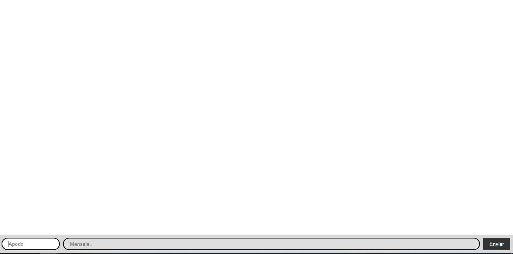
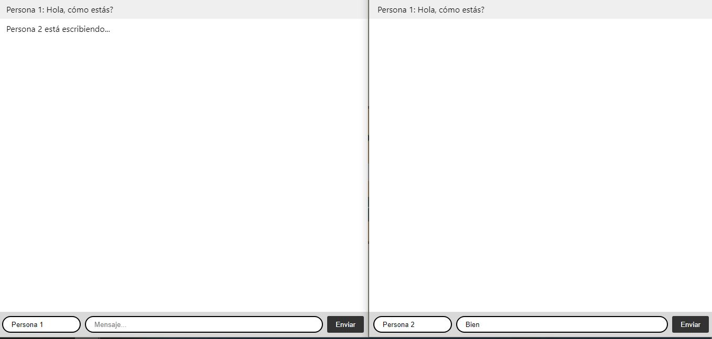
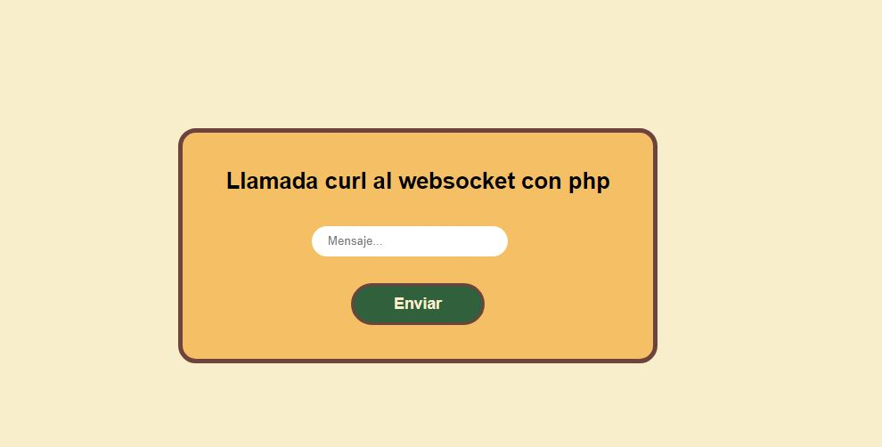
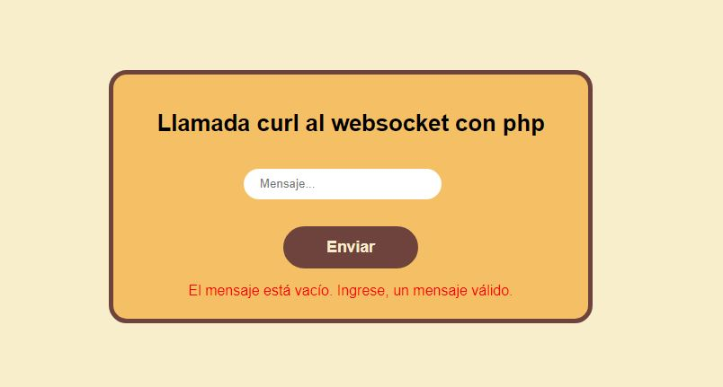
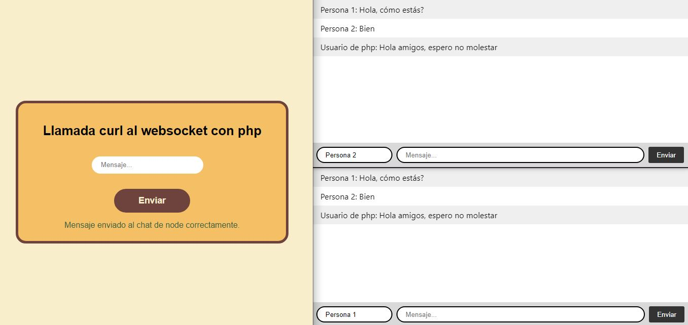

# Prueba de la Cámara de Comercio del Exterior
La prueba consiste en realizar el tutorial de la página de [Socket.io](https://socket.io/get-started/chat), el cuál se nos enseña a crear una aplicación de chat básica para entender mejor el concepto de websockets. Una vez finalizado el tutorial se pasará a realizar una llamada cURL desde un archivo php.

# Instalación
1. En primer lugar, se deberá de tener instalado Node.js.
2. Para esta ocasión para correr los archivos php, se empleará Xampp.
3. Se deberá clonar el repositorio a la carpeta deseada de su equipo. El repositorio contiene dos carpetas:
   <ul>
      <li>php: Contiene los archivos php que deberán ser ubicados en la carpeta htppdocs de Xampp para poder ser sdasdas</li>
      <li>dasdas: Contiene los archivos de la aplicación en Node.</li>
   </ul> 
5. En el caso de la aplicación php, solo basta con ponerla dentro de httpdocs que se encuentra ubicado en la ruta dónde se instaló Xampp y activar el botón Start de la interfaz del mismo.
6. Por otro lado, para la aplicación de node, una vez de ubicarse mediante consola en la ruta correcta, se deberá de digitar el comando npm install para instalar las dependencias que se encuentran en el archivo package.json y tener todo listo para correr la aplicación. Notarás que el contenido de los archivos son diferentes al tutorial. Esto es debido a qué se implementó cambios para poder recibir la llamada. Asimismo, se implementó algunas funcionalidades nuevas.
7. Finalmente, se deberá usar el siguiente comando: node ./app/index.js para ejecutar la aplicación de chat.

# Capturas
A continuación se mostrarán algunas capturas del proyecto:

1. Vistas de la aplicación de chat terminada
   Aplicación terminada corriendo en el puerto 3000 del ambiente local
   
   

     
   

   Prueba del funcionamiento del chat
   
   

     
   

2. Vista de la aplicación de php que ejecutará la llamada cURL
   Aplicación corriendo mediante Xampp
   
   

     
   

   Validación de que no se envié un mensaje vacío
   
   

     
   

3. Aplicaciones conectadas entre sí
  
   

     
   

# Consideraciones
Esta es una demo básica para demostrar que se puede realizar un llamada cURL desde php hasta un websockte, por lo que hay muchas cosas que se pueden mejorar o implementar ya sea en el aspecto visual o agregando algunas funciones.
